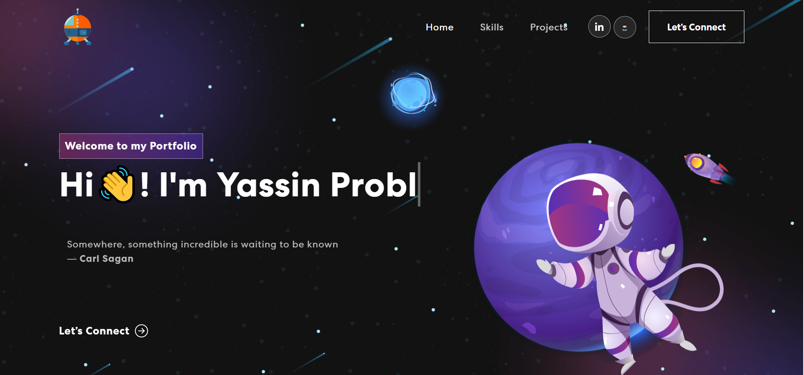

# My Personal Portfolio Website in React

This project was bootstrapped with [Create React App](https://github.com/facebook/create-react-app).

Built using:

- Front-end library: React
- CSS framework: React-bootstrap
- CSS animations library: Animate.css

In the /personal-portfolio, you can run:

#### Inspired by <a href='https://github.com/judygab'>
judygab</a>
